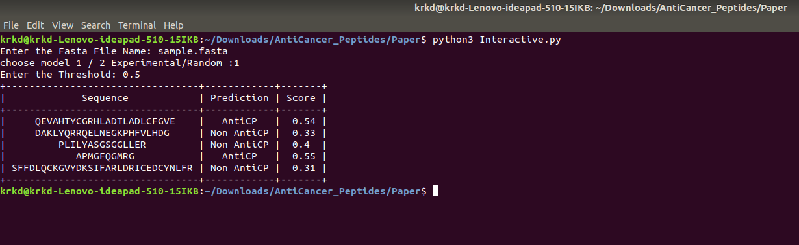

# AntiCancer_Peptides (ACPs)
The current study describes a method "AntiCP 2.0" which predicts and design novel AntiCancer Peptides (ACPs). Anticancer peptides (ACPs) are part of the antimicrobial peptide group which exhibits anticancer activity. These are small cationic peptides 5-50 amino acids in length. Mostly they possess alpha helix as the secondary structure or folds into beta sheet.
Two datasets were created for developing prediction methods (i) Main dataset and (ii) Alternate dataset. Positive dataset comprises of experimentally verified ACPs and is common in both datasets. In case of main dataset, negative peptides comprises of Antimicrobial Peptides (AMPs) having other activity than anticancer. In case of Alternate dataset, negative peptides comprises of randomly generated peptides using SwissProt Proteins.
Several machine learning models were implemented for developing prediction models such as Support Vector Classifier, Random Forest, ExtraTree, K-Nearest Neighbor, MultiLayer Perceptron and Ridge. Amon all these, ExtraTree Classifier perfromed best and hence is provided here for prediction. The same model is implemented at our website "AntiCP 2.0" too which is available at the link https://webs.iiitd.edu.in/raghava/anticp2/ .
We also benchmarked our method with previous methods and found that our method benchmarked previous methods.

## Instructions for Installation 
```bash
git clone https://github.com/dhruv16146/AntiCancer_Peptides 
```

```bash
cd Paper 
```


```bash
bash Dependencies.bash 
```


```bash
python3 Interactive.py
```

## Interactive

